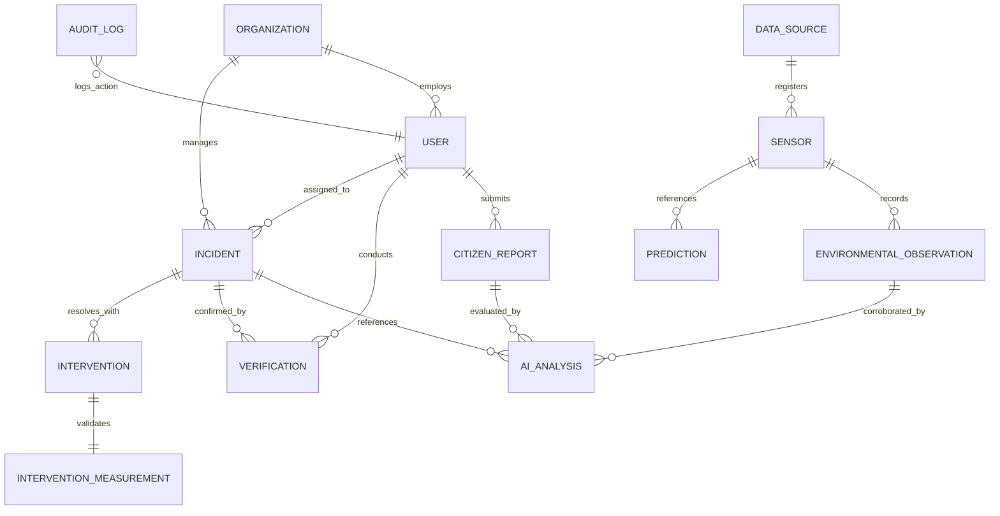

# Data Architecture Specification

## 1. Relational Entity-Relationship Diagram

ClimaX models the complete environmental cycle from observation to human mitigation across 16 core entities:

---

## 2. Core Entity Catalog

| Entity | Primary Storage | Key Attributes | Geospatial Representation |
| :--- | :--- | :--- | :--- |
| **Organization** | PostgreSQL | `name`, `jurisdiction_code`, `department` | Polygon (Administrative Boundary) |
| **User** | PostgreSQL | `email`, `role`, `organization_id` | N/A |
| **DataSource** | PostgreSQL | `name`, `source_type`, `provider`, `refresh_interval` | N/A |
| **Sensor** | PostgreSQL | `external_sensor_id`, `sensor_type`, `is_calibrated` | Point (WGS84 EPSG:4326) |
| **EnvironmentalObservation** | PostgreSQL & BigQuery | `timestamp`, `pm25`, `pm10`, `no2`, `tier=OBSERVED` | Point (Inherited from Sensor) |
| **CitizenReport** | PostgreSQL | `category`, `description`, `media_urls`, `status` | Point (WGS84 EPSG:4326) |
| **AIAnalysis** | PostgreSQL | `classification`, `explanation_json`, `tier=INFERRED` | Polygon (Plume Bounding Box) |
| **PollutionEvent** | PostgreSQL | `event_type`, `peak_pm25`, `affected_radius_meters` | Polygon (WGS84 EPSG:4326) |
| **Prediction** | PostgreSQL & BigQuery | `forecast_timestamp`, `horizon_hours`, `predicted_aqi` | Point / Plume Contour Polygon |
| **RiskAssessment** | PostgreSQL | `risk_score`, `population_vulnerability_index` | Point / H3 Hexcell |
| **Alert** | PostgreSQL | `title`, `severity`, `channel`, `is_dispatched` | Polygon (Broadcast Geofence) |
| **Incident** | PostgreSQL | `title`, `status`, `severity`, `category` | Point (WGS84 EPSG:4326) |
| **Verification** | PostgreSQL | `verified_at`, `status`, `official_notes`, `tier=VERIFIED`| Point (Field Officer Location) |
| **Intervention** | PostgreSQL | `intervention_type`, `executing_agency`, `action_summary`| Point / Line (Watering Route) |
| **InterventionMeasurement**| PostgreSQL | `pre_pm25`, `post_pm25`, `delta_percent`, `significance` | Point (Impact Zone) |
| **AuditLog** | PostgreSQL & BigQuery | `user_id`, `action`, `entity_name`, `changes_json` | N/A |

---

## 3. Storage Tiering Strategy

1. **Transactional / Hot Spatial Tier (PostgreSQL 16 + PostGIS)**:
   - Stores active incident queues, user profiles, current sensor metadata, and rolling 30-day telemetry.
   - Spatial indexing: `GIST (geom)` for sub-millisecond point-in-polygon and radius proximity filters.
2. **Analytical / Cold Warehousing Tier (Google BigQuery)**:
   - Ingests all historical observations via Pub/Sub streaming buffer.
   - Partitioned by `DATE(timestamp)` to optimize query cost; clustered by `sensor_id` and `tier`.
3. **Unstructured Binary Tier (Google Cloud Storage)**:
   - Holds citizen photos, video footage, field inspection certificates, and satellite GeoTIFF files.
   - Managed with 15-minute signed URLs to prevent unauthorized direct bucket access.
